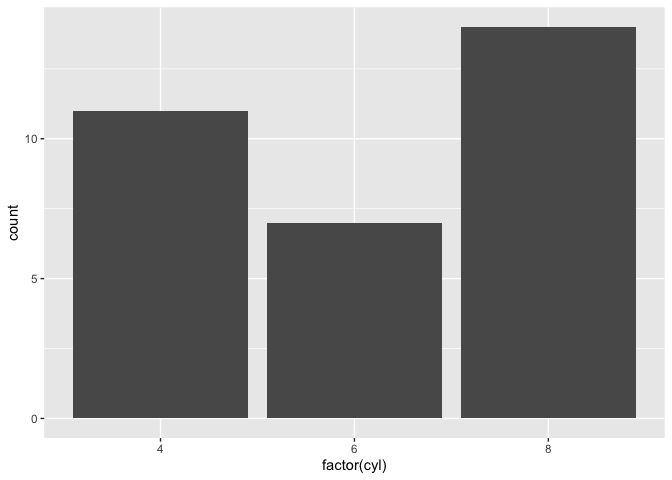

# This is my first Markdown file
## This is my first markdown file
### This is my first markdown file


```r
4*2
```

```
## [1] 8
```

## This is my email [email](mailto:mibarra@ucdavis.edu)

## This is [Google](https://www.google.com)

# [BIS 15L Webpage](https://jmledford3115.github.io/datascibiol/)

### _1. Arithmetic Practice_


```r
2*2
```

```
## [1] 4
```

```r
5+7
```

```
## [1] 12
```


### _2. Titles/Text/Syntax_

# **Bold**

# _Italics_

### _*Bold and Italics*_


```r
#install.packages("tidyverse")
library("tidyverse")
```


```r
ggplot(mtcars, aes(x = factor(cyl))) +
    geom_bar()
```

<!-- -->
