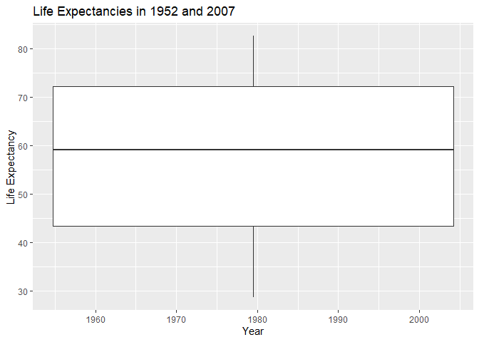
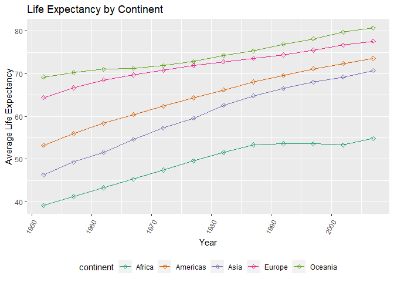
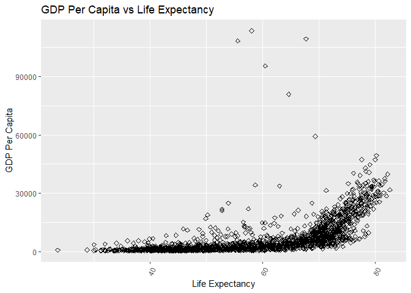
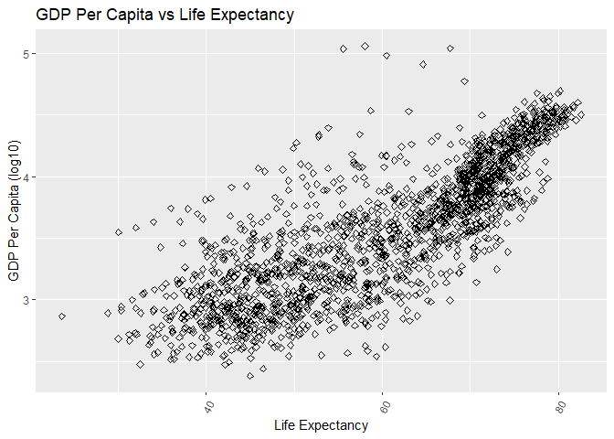
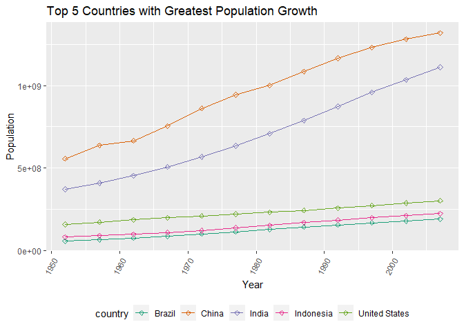
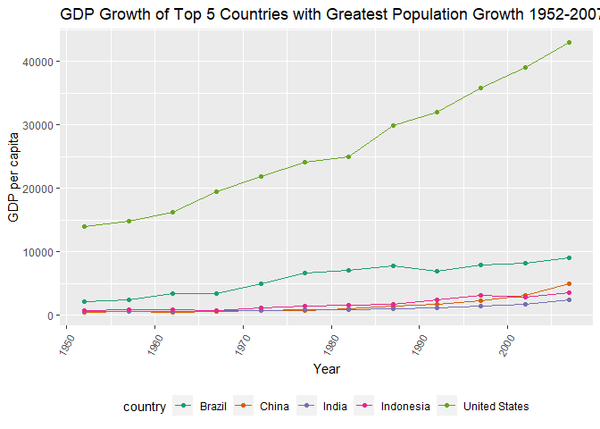

## Instructions
Answer the following questions and complete the exercises in RMarkdown. Please embed all of your code and push your final work to your repository. Your final lab report should be organized, clean, and run free from errors. Remember, you must remove the `#` for the included code chunks to run. Be sure to add your name to the author header above. For any included plots, make sure they are clearly labeled. You are free to use any plot type that you feel best communicates the results of your analysis.  

**In this homework, you should make use of the aesthetics you have learned. It's OK to be flashy!**

Make sure to use the formatting conventions of RMarkdown to make your report neat and clean!  

## Load the libraries

```r
library(tidyverse)
library(janitor)
library(here)
library(naniar)
```

## Resources
The idea for this assignment came from [Rebecca Barter's](http://www.rebeccabarter.com/blog/2017-11-17-ggplot2_tutorial/) ggplot tutorial so if you get stuck this is a good place to have a look.  

## Gapminder
For this assignment, we are going to use the dataset [gapminder](https://cran.r-project.org/web/packages/gapminder/index.html). Gapminder includes information about economics, population, and life expectancy from countries all over the world. You will need to install it before use. This is the same data that we will use for midterm 2 so this is good practice.

```r
#install.packages("gapminder")
library("gapminder")
```

## Questions
The questions below are open-ended and have many possible solutions. Your approach should, where appropriate, include numerical summaries and visuals. Be creative; assume you are building an analysis that you would ultimately present to an audience of stakeholders. Feel free to try out different `geoms` if they more clearly present your results.  

**1. Use the function(s) of your choice to get an idea of the overall structure of the data frame, including its dimensions, column names, variable classes, etc. As part of this, determine how NA's are treated in the data.**  

Our initial analyses suggest that there are no NA's in this data. 


```r
glimpse(gapminder)
```

```
## Rows: 1,704
## Columns: 6
## $ country   <fct> Afghanistan, Afghanistan, Afghanistan, Afghanistan, Afghani…
## $ continent <fct> Asia, Asia, Asia, Asia, Asia, Asia, Asia, Asia, Asia, Asia,…
## $ year      <int> 1952, 1957, 1962, 1967, 1972, 1977, 1982, 1987, 1992, 1997,…
## $ lifeExp   <dbl> 28.801, 30.332, 31.997, 34.020, 36.088, 38.438, 39.854, 40.…
## $ pop       <int> 8425333, 9240934, 10267083, 11537966, 13079460, 14880372, 1…
## $ gdpPercap <dbl> 779.4453, 820.8530, 853.1007, 836.1971, 739.9811, 786.1134,…
```


```r
summary(gapminder)
```

```
##         country        continent        year         lifeExp     
##  Afghanistan:  12   Africa  :624   Min.   :1952   Min.   :23.60  
##  Albania    :  12   Americas:300   1st Qu.:1966   1st Qu.:48.20  
##  Algeria    :  12   Asia    :396   Median :1980   Median :60.71  
##  Angola     :  12   Europe  :360   Mean   :1980   Mean   :59.47  
##  Argentina  :  12   Oceania : 24   3rd Qu.:1993   3rd Qu.:70.85  
##  Australia  :  12                  Max.   :2007   Max.   :82.60  
##  (Other)    :1632                                                
##       pop              gdpPercap       
##  Min.   :6.001e+04   Min.   :   241.2  
##  1st Qu.:2.794e+06   1st Qu.:  1202.1  
##  Median :7.024e+06   Median :  3531.8  
##  Mean   :2.960e+07   Mean   :  7215.3  
##  3rd Qu.:1.959e+07   3rd Qu.:  9325.5  
##  Max.   :1.319e+09   Max.   :113523.1  
## 
```


```r
naniar::miss_var_summary(gapminder)
```

```
## # A tibble: 6 x 3
##   variable  n_miss pct_miss
##   <chr>      <int>    <dbl>
## 1 country        0        0
## 2 continent      0        0
## 3 year           0        0
## 4 lifeExp        0        0
## 5 pop            0        0
## 6 gdpPercap      0        0
```

```r
gapminder <- janitor::clean_names(gapminder)
```


**2. Among the interesting variables in gapminder is life expectancy. How has global life expectancy changed between 1952 and 2007?**


```r
gapminder %>% 
  group_by(year) %>% 
  summarize(avg_life_exp = mean(life_exp)) %>% 
  ggplot(aes(x = year, y = avg_life_exp))+
  geom_col()+
  labs(title = "Global Life Expectancy Trends 1952-2007", x = "Year", y = "Average Life Expectancy")
```

<!-- -->


**3. How do the distributions of life expectancy compare for the years 1952 and 2007?**


```r
gapminder %>% 
  group_by(year) %>% 
  filter(year == "1952"| year == "2007") %>% 
  summarise(mean_life_expectancy = mean(life_exp),
            max_life_expectancy = max(life_exp),
            min_life_expectancy = min(life_exp), .groups = "keep" )
```

```
## # A tibble: 2 x 4
## # Groups:   year [2]
##    year mean_life_expectancy max_life_expectancy min_life_expectancy
##   <int>                <dbl>               <dbl>               <dbl>
## 1  1952                 49.1                72.7                28.8
## 2  2007                 67.0                82.6                39.6
```


```r
gapminder %>%
  filter(year == 1952 | year == 2007) %>% 
  group_by(year) %>% 
  ggplot(aes(x = year, y = life_exp)) +
  geom_boxplot()+
  labs(title = "Life Expectancies in 1952 and 2007", x= "Year", y = "Life Expectancy")
```

```
## Warning: Continuous x aesthetic -- did you forget aes(group=...)?
```

<!-- -->


**4. Your answer above doesn't tell the whole story since life expectancy varies by region. Make a summary that shows the min, mean, and max life expectancy by continent for all years represented in the data.**

```r
gapminder %>% 
  group_by(continent, year) %>% 
  summarise(mean_life_expectancy = mean(life_exp),
            max_life_expectancy = max(life_exp),
            min_life_expectancy = min(life_exp), .groups = "keep" )
```

```
## # A tibble: 60 x 5
## # Groups:   continent, year [60]
##    continent  year mean_life_expectancy max_life_expectancy min_life_expectancy
##    <fct>     <int>                <dbl>               <dbl>               <dbl>
##  1 Africa     1952                 39.1                52.7                30  
##  2 Africa     1957                 41.3                58.1                31.6
##  3 Africa     1962                 43.3                60.2                32.8
##  4 Africa     1967                 45.3                61.6                34.1
##  5 Africa     1972                 47.5                64.3                35.4
##  6 Africa     1977                 49.6                67.1                36.8
##  7 Africa     1982                 51.6                69.9                38.4
##  8 Africa     1987                 53.3                71.9                39.9
##  9 Africa     1992                 53.6                73.6                23.6
## 10 Africa     1997                 53.6                74.8                36.1
## # … with 50 more rows
```

```r
gapminder %>% 
  group_by(year, continent) %>%
  ggplot(aes(x = year, y = life_exp, fill = continent)) +
  geom_boxplot()+
  labs(title = "Life Expectancies by Continent", x = "Year", y = "Life Expectancy")
```

<!-- -->

**5. How has life expectancy changed between 1952-2007 for each continent?**


```r
gapminder %>% 
  group_by(year, continent) %>% 
  summarise(avg_life_exp = mean(life_exp), .groups = "keep") %>% 
  ggplot(aes(x =  year, y = avg_life_exp, color = continent, group = continent)) +
  geom_point(shape = 5)+
  geom_line() +
  labs(title = "Life Expectancy by Continent", x = "Year", y = "Average Life Expectancy") +
  theme(legend.position = "bottom",
        axis.text.x = element_text(angle = 60, hjust=1))+
  scale_colour_brewer(palette = "Dark2")
```

<!-- -->


**6. We are interested in the relationship between per capita GDP and life expectancy; i.e. does having more money help you live longer?**


```r
gapminder %>% 
  ggplot(aes(x = life_exp, y = gdp_percap)) +
  geom_point(shape = 5) +
  theme(legend.position = "bottom", axis.text.x = element_text(angle = 60, hjust=1))+
  labs(title = "GDP Per Capita vs Life Expectancy", x = "Life Expectancy", y = "GDP Per Capita")
```

<!-- -->

```r
gapminder %>% 
  ggplot(aes(x = life_exp, y = log10(gdp_percap))) +
  geom_point(shape = 5) +
  theme(legend.position = "bottom", axis.text.x = element_text(angle = 60, hjust=1))+
  labs(title = "GDP Per Capita vs Life Expectancy", x = "Life Expectancy", y = "GDP Per Capita (log10)")
```

<!-- -->

**7. Which countries have had the largest population growth since 1952?**

The countries with the largest population growth are China, India, the US, Indonesia, and Brazil.


```r
gapminder2 <- gapminder %>% 
  select(country, year, pop) %>% 
  group_by(country) %>% 
  filter(year == "1952" | year == "2007") %>% 
  pivot_wider(names_from = year,
              names_prefix = "year_",
              values_from = pop) %>% 
  mutate(growth = year_2007 - year_1952) %>% 
  arrange(desc(growth))
```

**8. Use your results from the question above to plot population growth for the top five countries since 1952.**


```r
gapminder %>% 
  filter(country == "China" | country == "India" | country == "United States" | country == "Indonesia" | country == "Brazil") %>% 
  ggplot(aes(x = year, y = pop, group = country, color = country)) +
  geom_line()+
  geom_point(shape = 5)+
  labs(title = "Top 5 Countries with Greatest Population Growth", x = "Year", y = "Population") +
  theme(legend.position = "bottom",
        axis.text.x = element_text(angle = 60, hjust=1))+
  scale_colour_brewer(palette = "Dark2")
```

<!-- -->


**9. How does per-capita GDP growth compare between these same five countries?**


```r
gapminder %>% 
  filter(country == "China" | country == "India" | country == "United States" | country == "Indonesia" | country == "Brazil") %>% 
  ggplot(aes(x = year, y = gdp_percap, group = country, color = country)) +
  geom_line()+
  geom_point()+
  labs(title = "GDP Growth of Top 5 Countries with Greatest Population Growth 1952-2007", x = "Year", y = "GDP per capita") +
  theme(legend.position = "bottom",
        axis.text.x = element_text(angle = 60, hjust=1))+
  scale_colour_brewer(palette = "Dark2")
```

<!-- -->


**10. Make one plot of your choice that uses faceting!**


```r
gapminder %>% 
  ggplot(aes(x = life_exp)) +
  geom_density() +
  facet_wrap(~continent) +
  labs(title = "Life Expectancy Between Continents", y = "Density", x = "Life Expectancy")
```

<!-- -->


## Push your final code to GitHub!
Please be sure that you check the `keep md` file in the knit preferences. 
